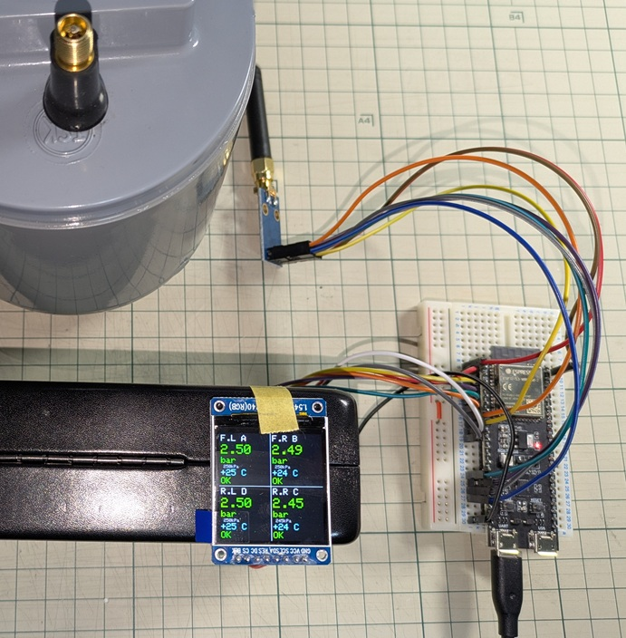

# TPMS受信機

ESP32-S3 + CC1101 を使ったタイヤ空気圧モニタ（TPMS）センサー受信機プロジェクト。

- 433.92MHz / 9.6kbps / Manchester符号化
- 4輪センサーの空気圧・温度・急変アラートをデコード
- 利用センサー：Jansite TPMS TY618-Nの付属
 

## ドキュメント

[ハードウェア構成・フレーム構造・解析結果](doc/index.md)

## 環境

- マイコン: ESP32-S3-WROOM-2 N32R16V
- 受信IC: CC1101
- LCD: 秋月電子 M154-240240-RGB（ST7789, 240×240）
- フレームワーク: PlatformIO / Arduino
